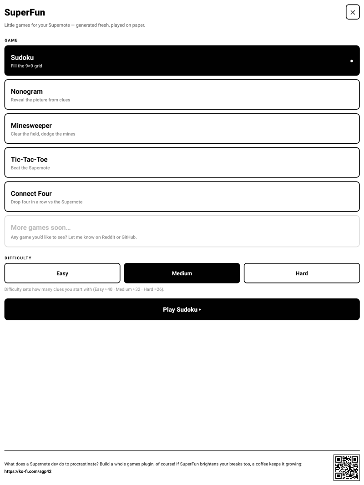
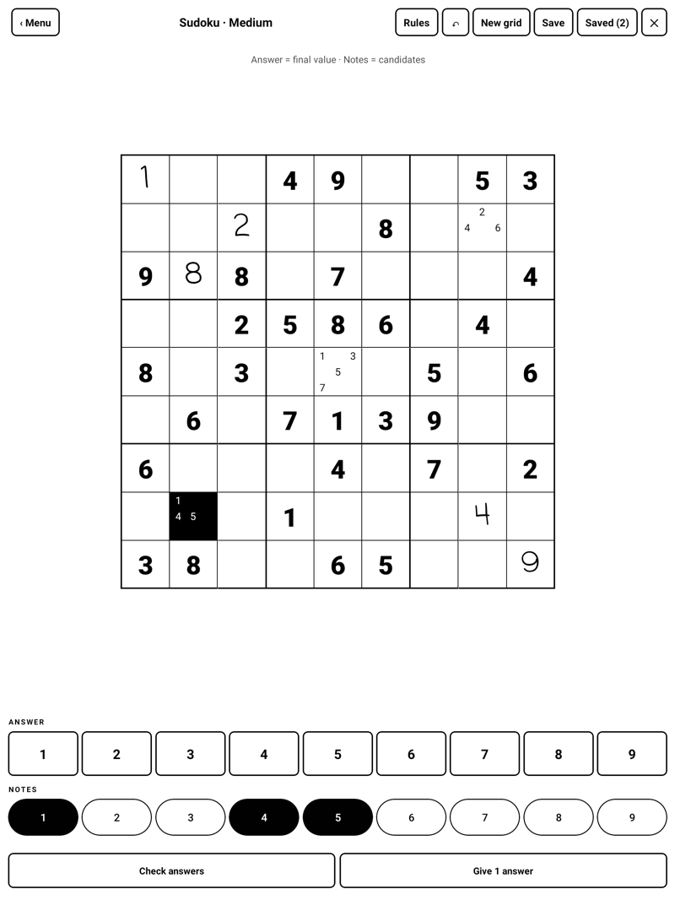
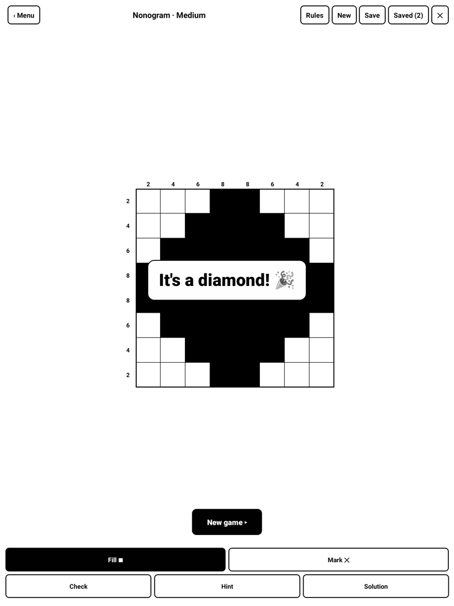
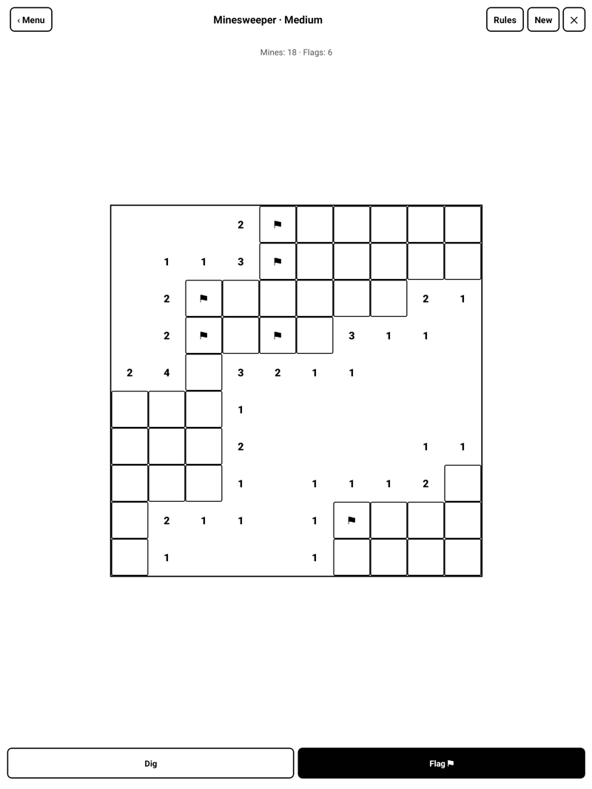
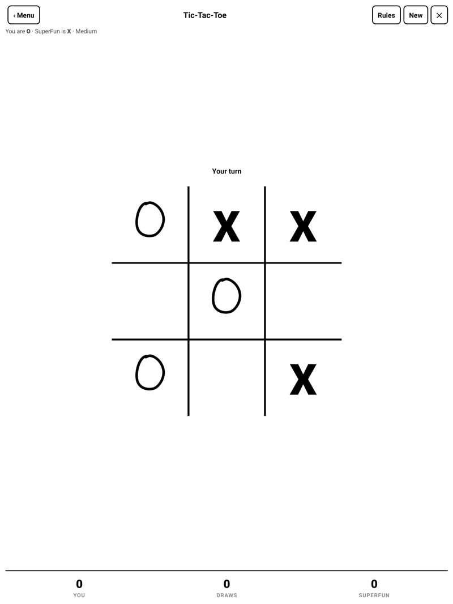
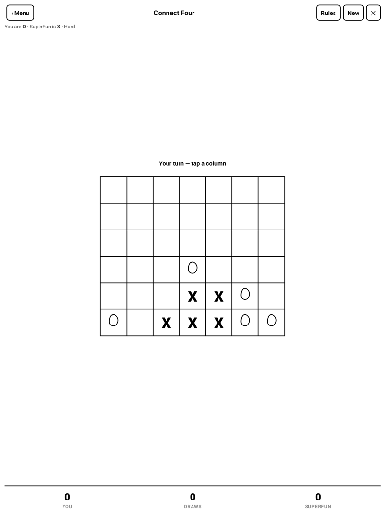
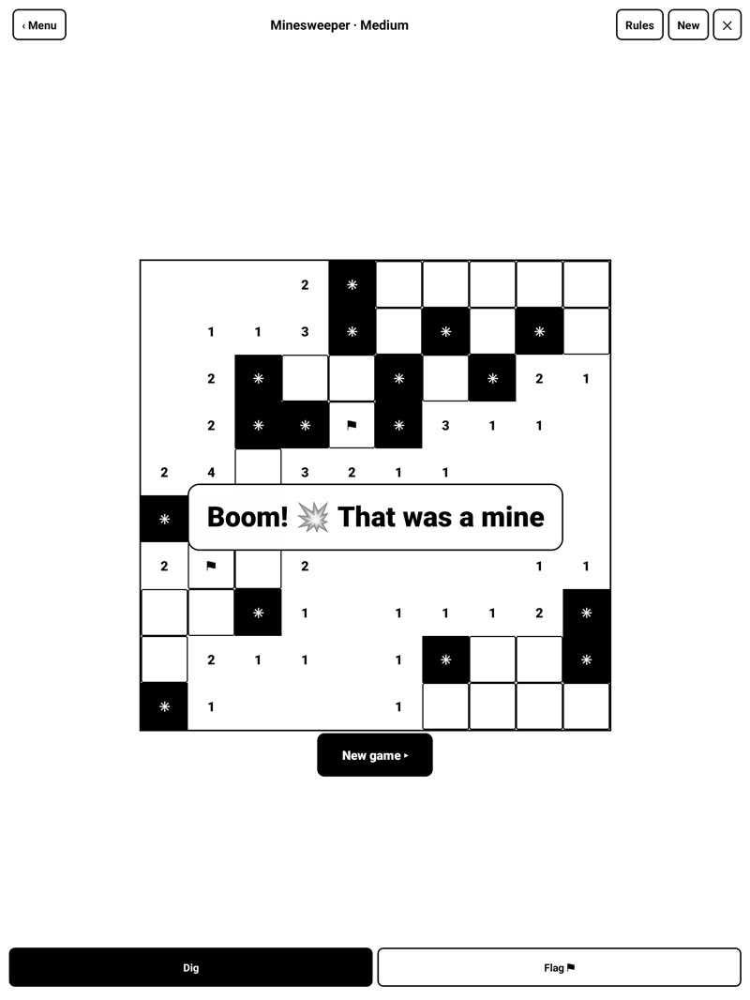
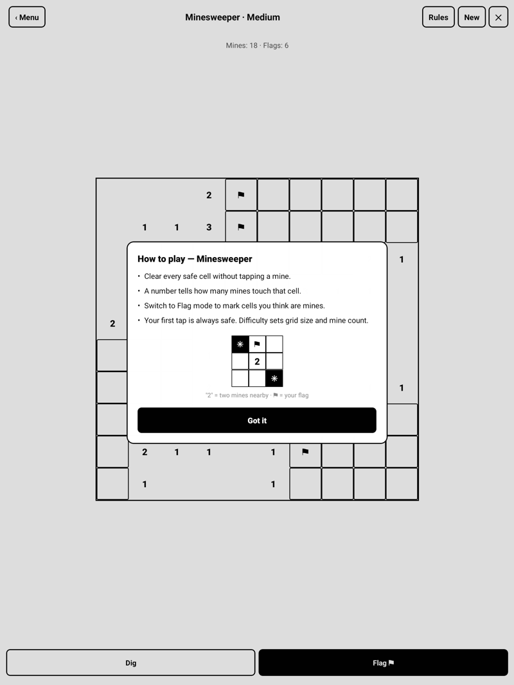

<div align="center">

# SuperFun

**Little games for your Supernote — generated fresh, played on paper.**

A plugin that turns your Supernote e‑ink tablet into a pocket arcade of calm,
paper‑friendly games. Pure black &amp; white, finger‑first, no animation, no
network — everything is generated and played right on the device.


</div>

---

## Games

| Game | Type | What it does |
|------|------|--------------|
| **Sudoku** | Solo puzzle | Unique‑solution grids generated on device. Two‑list input (Answer / Notes), handwritten entries, Check & Give‑a‑hint, and savable grids. |
| **Nonogram** (Picross) | Solo puzzle | Reveal the picture from row/column clues. Fill / Mark modes, Check, Hint and Solution, and savable grids. |
| **Minesweeper** | Solo puzzle | Classic sweep with a guaranteed‑safe first tap. Dig / Flag modes, three sizes. |
| **Tic‑Tac‑Toe** | vs the Supernote | You’re O and move first; the Supernote plays X with a minimax AI. **Hard is unbeatable.** Running scoreboard. |
| **Connect Four** | vs the Supernote | Drop four in a row against an alpha‑beta AI. Running scoreboard. |

Every game ships with an in‑app **“Rules”** card (with a small worked example), so
there’s nothing to memorise.

## Highlights

- **Generated on device** — Sudoku grids are guaranteed to have a *unique*
  solution; Nonograms and Minesweeper boards are made fresh each time. No bundled
  puzzle bank, effectively endless.
- **Real opponents** — the duel games use a proper game‑tree search (minimax /
  alpha‑beta). Easy plays loose, Hard plays sharp.
- **Persistent saves** — Sudoku & Nonogram grids can be saved and resumed *after
  closing the plugin*, stored as JSON in `MyStyle/Plugins/SuperFun/`. Each save is
  tagged with a grid fingerprint and a timestamp; re‑saving the same grid updates
  its own entry.
- **Three difficulty levels** for every game.
- **Built for e‑ink** — high‑contrast B/W, large tap targets, no animation, and a
  layout where the board never jumps around while you play.
- **Handwriting‑style entries** — your answers render in a handwritten face,
  clearly distinct from the printed clues.

## Screenshots

| Home | Sudoku | Nonogram |
|------|--------|----------|
|  |  |  |

| Minesweeper | Tic‑Tac‑Toe | Connect Four |
|-------------|-------------|--------------|
|  |  |  |

| Big end‑of‑game message | In‑app rules, with a worked example |
|-------------------------|-------------------------------------|
|  |  |

## Install (on the device)

1. Copy `superfun-<version>.snplg` to the **`MyStyle/`** folder on your Supernote
   (USB, or `adb push … /storage/emulated/0/MyStyle/`).
2. On the device: **Settings → Apps → Plugins → Add Plugin → SuperFun**.
3. Open it from the plugin toolbar inside a note or document.

> Updating? Uninstall the old SuperFun first, then add the new one — it ships
> native code, so a clean reinstall is the reliable path.

## Build from source

Requires Node ≥ 18, JDK ≥ 19 and the Android SDK (Platform 35, Build‑Tools 35.0.0).

```bash
npm install
# point these at a JDK 19+ and the Android SDK (Platform 35, Build-Tools 35.0.0)
export JAVA_HOME=/path/to/jdk
export ANDROID_HOME=/path/to/android-sdk
./buildPlugin.sh          # → build/outputs/superfun.snplg
```

`buildPlugin.sh` bundles the JS, compiles the native module and packages the
`.snplg`. (`./bump-and-build.sh` does the same but auto-increments the version and
names the file `superfun-<version>.snplg`.)

## Under the hood

- **React Native 0.79.2** on the Supernote **PluginHost** runtime, via
  [`sn-plugin-lib`](https://www.npmjs.com/package/sn-plugin-lib).
- Game engines are dependency‑free JavaScript modules in [`src/`](src) — `sudoku.js`,
  `nonogram.js`, `minesweeper.js`, `tictactoe.js`, `connect4.js` — usable and testable
  outside the app.
- A tiny native Kotlin module (`FileStore`) provides `writeText`/`readText` so saves
  can persist to disk (the SDK exposes no generic file‑write from JS).

## Support

SuperFun is free. If it earns a spot in your breaks, you can drop a coffee in the jar:
**[ko‑fi.com/agp42](https://ko-fi.com/agp42)** ☕

## License

MIT — see [LICENSE](LICENSE).
